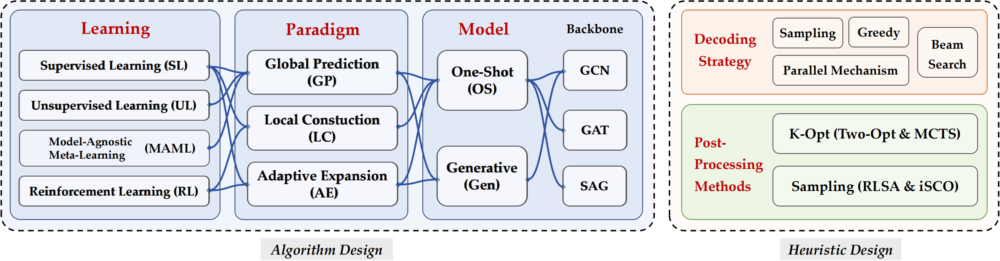

# ML4CO-Bench-101 [Under Review]

## 📚 Brief Introductions

**Abstract:** Combinatorial problems on graphs have attracted extensive efforts from the machine learning community over the past decade. Despite notable progress in this area under the umbrella of ML4CO, a comprehensive categorization, unified reproducibility, and transparent evaluation protocols are still lacking for the emerging and immense pool of neural CO solvers. In this paper, we establish a modular and streamlined framework benchmarking prevalent neural CO methods, dissecting their design choices via a tri-leveled ``paradigm-model-learning'' taxonomy to better characterize different approaches. Further, we integrate their shared features and respective strengths to form 3 unified solvers representing global prediction (GP), local construction (LC), and adaptive expansion (AE) mannered neural solvers. We also collate a total of 34 datasets for 7 mainstream CO problems (including both edge-oriented tasks: TSP, ATSP, CVRP, as well as edge-oriented: MIS, MCut, MVC, MCut) across scales to facilitate more comparable results among literature. Extensive experiments upon our benchmark reveal a fair and exact performance exhibition indicative of the raw contribution of the learning components in each method, rethinking and insisting that pre- and post-inference heuristic tricks are not supposed to compensate for sub-par capability of the data-driven counterparts. Under this unified benchmark, an up-to-date replication of typical ML4CO methods is maintained, hoping to provide convenient reference and insightful guidelines for both engineering development and academic exploration of the ML4CO community in the future.




## 📈 Our Systematic Benchmark Works

We are systematically building a foundational framework for ML4CO with a collection of resources that complement each other in a cohesive manner.


⭐ [Awesome-ML4CO](https://github.com/Thinklab-SJTU/awesome-ml4co), a curated collection of literature in the ML4CO field, organized to support researchers in accessing both foundational and recent developments.

⭐ [ML4CO-Kit](https://github.com/Thinklab-SJTU/ML4CO-Kit), a general-purpose toolkit that provides implementations of common algorithms used in ML4CO, along with basic training frameworks, traditional solvers and data generation tools. It aims to simplify the implementation of key techniques and offer a solid base for developing machine learning models for COPs.

⭐ [ML4TSPBench](https://github.com/Thinklab-SJTU/ML4TSPBench): a benchmark focusing on exploring the TSP for representativeness. It offers a deep dive into various methodology designs, enabling comparisons and the development of specialized algorithms.

⭐ [ML4CO-Bench-101](https://github.com/Thinklab-SJTU/ML4CO-Bench-101): a benchmark that categorizes neural combinatorial optimization (NCO) solvers by solving paradigms, model designs, and learning strategies. It evaluates applicability and generalization of different NCO approaches across a broad range of combinatorial optimization problems to uncover universal insights that can be transferred across various domains of ML4CO.

## 📦 Setup

Please follow the steps below to set up the experimental environment for ML4CO-Bench-101

> **Step1: check the OS and the ``cuda`` driver**

First, ensure that your experimental environment is a ``linux`` system with ``cuda`` installed. Then, check your nvidia cuda driver.

```bash
nvcc -V
```

> **Step2: install the ``pytorch`` environment with ``cuda``**

Note that you should install ``pytorch`` and related extension packages with the same major version number as your CUDA driver. You can find the quick installation wheels [here](https://pytorch-geometric.com/whl). The following is an installation script for ``python-3.8``, ``pytorch-2.1.0``, and ``cuda-12.1``.

```bash
conda create --name ml4co python=3.8
conda activate ml4co
pip install torch==2.1.0
pip install scipy==1.10.1
pip install --no-index torch-scatter -f https://pytorch-geometric.com/whl/torch-2.1.0+cu121.html
pip install --no-index torch-sparse -f https://pytorch-geometric.com/whl/torch-2.1.0+cu121.html
pip install --no-index torch-spline-conv -f https://pytorch-geometric.com/whl/torch-2.1.0+cu121.html
pip install --no-index torch-cluster -f https://pytorch-geometric.com/whl/torch-2.1.0+cu121.html
```

> **Step3: install ``pytorch-lightning``, ``tensordict``, ``WandB``, etc.**

The overall training framework of ``ML4CO-Bench-101`` is based on [``pytorch-lightning``](https://github.com/Lightning-AI/pytorch-lightning), [``tensordict``](https://github.com/pytorch/tensordict) and [``wandb``](https://github.com/wandb/wandb). Please install the corresponding packages.

```bash
pip install wandb==0.16.3 # >=0.16.3
pip install tensordict==0.2.0 # >=0.2.0
pip install pytorch-lightning==2.1.0 # consistent with the PyTorch version
pip install einops==0.8.0 # >=0.8.0
```

> **Step4: install ``ML4CO-Kit``**

We have developed the open-source toolkit [``ML4CO-Kit``](https://github.com/Thinklab-SJTU/ML4CO-Kit), which aims to provide: decoding or post-processing algorithms, traditional solvers, evaluators, data generators, visualization tools, and read-and-write functions for various types of data. ``ML4CO-Bench-101`` is based on this open-source toolkit, and the traditional solvers mentioned in ``Appendix D`` can be quickly invoked through this package. 

```bash
pip install ml4co-kit==0.3.3 # stable version (python=3.8~3.11)
```

**Note:** Due to specific dependencies of some repositories, we recommend you to use the version ``python-3.8``, ``pytorch-1.7.0`` and ``cuda-11.0`` for ``DIMES``. Then locally install ``torch_sampling`` and compile ``dense_greedy``:
```bash
pip install torch-geometric==2.0.4
cd dimes/model
pip install ./torch_sampling
cd model/decoder
gcc ./dimes_greedy_dense.c -o dense_greedy.so -fPIC -shared
```

**Note:** For ``LwD``, you need to install [``dgl``](https://github.com/dmlc/dgl), which provides convenient wheels [here](https://www.dgl.ai/pages/start.html).

## ⚡ Datasets and Pretrained Files

> **Step1: test-datasets and pretrained weights**

We use ``google drive`` to store our test-datasets and pre-trained files. 

* Please download test-datasets [here](https://drive.google.com/drive/folders/1d7pMissm8r6C0lNP0380zu3o505HN4PC?usp=drive_link) or [here](https://huggingface.co/datasets/ML4CO/ML4CO-Bench-101-SL/tree/main/test_dataset).
* Please download pre-trained files [here](https://drive.google.com/drive/folders/1DWWE-pVGgNJTNiXj2PADMT5q7SKbx0Hd?usp=drive_link).

> **Step2: train-datasets**

We use ``hugging-face`` to store our train-datasets. Please download them [here](https://huggingface.co/datasets/ML4CO/ML4CO-Bench-101-SL/tree/main/train_dataset).


> **ML4CO-Bench-101 Results**

We find that the ML4CO method outperform traditional solvers on some benchmark datasets. Besides, most neural methods achieved an advantage in speed. For the better future development of the community, we have for the first time released the ML4CO solution result dataset for the all benchmark datasets. The results are shown in the table below, and you can download the dataset [here](https://drive.google.com/drive/folders/1RfA6hr0896uihnOVtA6CsN0XjqRUMBA-?usp=sharing) or [here](https://huggingface.co/datasets/ML4CO/ML4CO-Bench-101-SL/tree/main/ml4co_result).


## 📝 Algorithm Design Correspondence Table

**Repetition of DiffUCO :** Due to the incompatibility of the underlying technology, please visit the original repository [here](https://github.com/ml-jku/DIffUCO) to reproduce the experiment.

**Repetition of LwD :** Due to the incompatibility of the underlying technology, please visit the original repository [here](https://github.com/sungsoo-ahn/learning_what_to_defer) to reproduce the experiment, and we provide the pretrained file for ``ER-700-800`` [here](https://drive.google.com/file/d/1yrPdYrBE0D5Z4JaD7fG20IYDIFG5KOCM/view?usp=drive_link). 

|   Past Method   |   Solver  |      Type      | TSP | ATSP | CVRP | MIS | MCl | MVC | MCut |
| :-------------- | :-------: | :-----------:  | :-: | :--: | :--: | :-: | :-: | :-: | :--: |
| ``gnn4co``      | ``GP4CO`` | ``GP-OS-SL``   | ✔ | ✔ | -- | ✔ | ✔ | ✔ | ✔ |
| ``dimes``       | ``GP4CO`` | ``GP-OS-MAML`` | ✔ | -- | -- | -- | -- | -- | -- |
| ``meta_egn``    | ``GP4CO`` | ``GP-OS-MAML`` | -- | -- | -- | ✔ | ✔ | ✔ | ✔ |
| ``utsp``        | ``GP4CO`` | ``GP-OS-UL``   | ✔ | -- | -- | -- | -- | -- | -- |
| ``vag_co``      | ``GP4CO`` | ``GP-OS-UL``   | -- | -- | -- | ✔ | ✔ | ✔ | ✔ |
| ``consistency`` | ``GP4CO`` | ``GP-Gen-SL``  | ✔ | ✔ | ✔ | ✔ | ✔ | ✔ | ✔ |
| ``goal``        | ``LC4CO`` | ``LC-OS-SL``   | ✔ | ✔ | ✔ | ✔ | ✔ | ✔ | -- |
| ``matnet``      | ``LC4CO`` | ``LC-OS-RL``   | -- | ✔ | -- | -- | -- | -- | -- |
| ``symnco``      | ``LC4CO`` | ``LC-OS-RL``   | ✔ | -- | ✔ | -- | -- | -- | -- |
| ``co_expander`` | ``AE4CO`` | ``AE-Gen-SL``  | ✔ | ✔ | ✔ | ✔ | ✔ | ✔ | ✔ |

## 🚀 Gettiing Started

> **Step1: how to train a model**

First, please download the train-datasets you need to your local machine and freely divide it into training and validation sets. We have provided training scripts for all problems in ``train_scripts`` folder. 

> **Step2: how to test a model**

First, please download the test-datasets and pre-trained files you need to your local machine. We have provided testing scripts for all problems in ``test_scripts`` folder.


## ✨ Citation

If you find ML4CO-Bench-101 valuable for your research or applied projects, please cite:

 ``https://github.com/Thinklab-SJTU/ML4CO-Bench-101``
